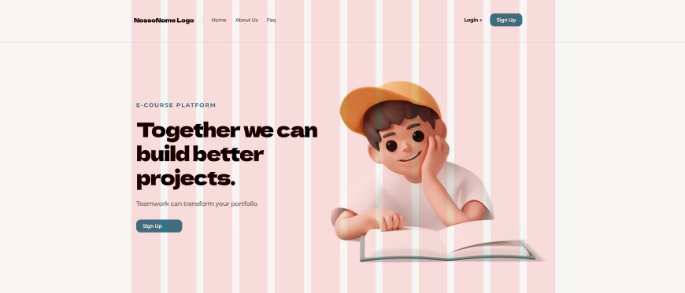

<h1 align="center">
    
</h1>

<h1 align="center"> 
	🚧 ProjetDev 1.0 🚀 em construção... 🚧
</h1>

## 💻 ProjetDev

<br>
<p >🚀 Platform to develop projects, share ideas and knowledge, learn and teach more about coding online with people around the world.</p>

<p>
  
 
 


<a href="linkrepoaqui">

</a>
<a href="linkrepoaqui">

</a>
<a href="https://github.com/tgmarinho/nlw1/commits/master">

</a>

</p>

# Table of contents

<!--ts-->

- [ProjetDev](#projetDev)
- [Table of contents](#table-of-contents)
- [Installation](#installation)
- [Layout](#layout)

  - [Mobile](#mobile)

  - [Desktop](#desktop)

- [Tests Frontend](#testesFrontend)
- [Tests Backend](#testesBackend)
- [Technologies](#technologies)
- [License](#license)

<!--te-->

# Installation

## Initial Settings

First, you need to have <kbd>[NodeJS](https://nodejs.org/en/download/)</kbd> installed on your machine.

If you are using **Linux**, you can choose to install **Node** through the <kbd>[asdf]</kbd> version manager to ease the process of changing the **Node**, when needed.

You can also choose to use **yarn** instead of **npm**. You can install it by clicking on <kbd>[link][yarn]</kbd> , or through <kbd>[asdf]</kbd>.

```bash

    # Clone the repository
    $ git clone https://github.com/let-jrProjetos/projeta-dev.git

    # Enter the directory
    $ cd projeta-dev

    # Install the dependencies
    $ npm install

    # Start the project
    $ npm run dev
```

---

# Layout

 <br>

The full layout of the application is available in Figma:
<br>

  <a href="https://www.figma.com/file/gifUlF0gqqYLgBDH9Xzdoh/Projeta-Dev?type=design&node-id=1%3A915&mode=design&t=yfGgX0oyuXVeuMq7-1">
  
  </a>

### Mobile

### Desktop

# Tests Frontend

# Tests Backend

# Technologies

 <br>

The following tools were used in the construction of the project:

- [ReactJS](https://reactjs.org)
- [JavaScript](https://developer.mozilla.org/en-US/docs/Web/JavaScript)
- [Tailwind](https://tailwindcss.com/)

# License

Licensed under the [MIT License](./LICENSE).
